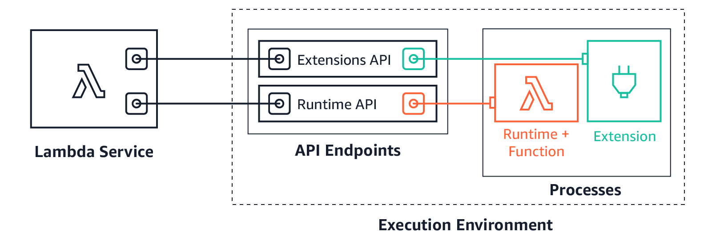

# How to implement sidecar pattern in AWS Lambda

## Introduction

The sidecar pattern is a powerful architectural pattern that allows you to extend the functionality of your main application without modifying its core logic. In the context of AWS Lambda, this pattern becomes particularly useful when you need to add cross-cutting concerns like authentication, logging, monitoring, or custom business logic that should run alongside your main function.

In this post, we'll explore how to implement the sidecar pattern in AWS Lambda using Lambda Extensions. We'll build a practical example where a Node.js Lambda function communicates with a Rust-based sidecar extension to generate JWT tokens.

## What is the Sidecar Pattern?

The sidecar pattern involves deploying a secondary component (the "sidecar") alongside your main application. This sidecar handles specific concerns like:

- **Authentication & Authorization**: Token generation, validation, and user management
- **Logging & Monitoring**: Centralized logging, metrics collection, and observability
- **Caching**: Redis or in-memory caching for frequently accessed data
- **Configuration Management**: Dynamic configuration updates and feature flags
- **Security**: Encryption, decryption, and security scanning

## Why Use Sidecar Pattern in AWS Lambda?

### Benefits:

1. **Separation of Concerns**: Keep your main business logic clean and focused
2. **Reusability**: The same sidecar can be used across multiple Lambda functions
3. **Technology Flexibility**: Use the best language for each concern (e.g., Rust for performance-critical operations)
4. **Independent Scaling**: Sidecars can be optimized and scaled independently
5. **Easier Testing**: Test sidecar functionality in isolation

### Use Cases:

- JWT token generation and validation
- Database connection pooling
- External API rate limiting
- Custom metrics and monitoring
- Security scanning and validation

## Project Structure

Our example consists of two main components:

```
aws-lambda-sidecar/
├── code/
│   ├── nodejs-demo-api/          # Main Lambda function (Node.js)
│   │   ├── src/
│   │   │   ├── app.ts            # Main application logic
│   │   │   └── package.json
│   │   └── template.yaml         # SAM template for main function
│   └── rust-demo-lambda-extension/  # Sidecar extension (Rust)
│       ├── src/
│       │   ├── main.rs           # Extension entry point
│       │   ├── extension.rs      # Lambda Extensions API integration
│       │   └── env.rs            # Environment utilities
│       ├── Cargo.toml
│       └── template.yaml         # SAM template for extension layer
```

## Implementation Details

### 1. The Main Lambda Function (Node.js)

Our main Lambda function is built with Hono, a lightweight web framework for TypeScript:

```typescript
// src/app.ts
import { Hono } from "hono";
import { handle } from "hono/aws-lambda";

const app = new Hono();
const TOKEN_URL = "http://localhost:3003/token";

app.get("/", (c) => c.json({ message: "Hello Hono!" }));

app.get("/get-auth-token", async (c) => {
  const response = await fetch(TOKEN_URL);
  const data = await response.text();
  return c.text(data);
});

export const handler = handle(app);
```

Key points:

- The function exposes two endpoints: `/` and `/get-auth-token`
- The `/get-auth-token` endpoint communicates with the sidecar via HTTP on `localhost:3003`
- The sidecar runs in the same Lambda execution environment

### 2. The Sidecar Extension (Rust)

The sidecar is implemented as a Lambda Extension using Rust:

```rust
// src/main.rs
use hyper::{Body, Request, Response, Server, Method, StatusCode};
use jsonwebtoken::{encode, EncodingKey, Header};
use serde::{Serialize};

#[derive(Serialize)]
struct Claims {
    sub: String,
    exp: usize,
}

#[derive(Serialize)]
struct TokenResponse {
    token: String,
    expires_at: usize,
    user_id: String,
    message: String,
}

async fn handle_request(req: Request<Body>) -> Result<Response<Body>, Infallible> {
    match (req.method(), req.uri().path()) {
        (&Method::GET, "/token") => {
            let claims = Claims {
                sub: "user123".to_string(),
                exp: 2000000000,
            };

            let secret = std::env::var("JWT_SECRET")
                .unwrap_or_else(|_| "super_secret".to_string());

            let token = encode(
                &Header::default(),
                &claims,
                &EncodingKey::from_secret(secret.as_ref())
            ).unwrap();

            let response = TokenResponse {
                token,
                expires_at: claims.exp,
                user_id: claims.sub.clone(),
                message: "JWT token generated successfully".to_string(),
            };

            let json_response = serde_json::to_string(&response).unwrap();

            Ok(Response::builder()
                .status(StatusCode::OK)
                .header("Content-Type", "application/json")
                .body(Body::from(json_response))
                .unwrap())
        }
        _ => {
            // Handle 404 for unknown endpoints
            let error_response = serde_json::json!({
                "error": "Endpoint not found",
                "message": "Use /token to get a JWT",
                "status": 404
            });

            Ok(Response::builder()
                .status(StatusCode::NOT_FOUND)
                .header("Content-Type", "application/json")
                .body(Body::from(error_response.to_string()))
                .unwrap())
        }
    }
}
```

### 3. Lambda Extensions API Integration

The extension integrates with AWS Lambda Extensions API to participate in the Lambda execution lifecycle:

```rust
// src/extension.rs
pub async fn register() {
    info!("Registering extension");
    let uri = make_uri("/register");

    let body = hyper::Body::from(r#"{"events":["INVOKE"]}"#);
    let mut request = hyper::Request::builder()
        .method("POST")
        .uri(uri)
        .body(body)
        .expect("Cannot create Lambda Extensions API request");

    request.headers_mut().append(
        "Lambda-Extension-Name",
        find_extension_name().try_into().unwrap(),
    );

    let response = send_request(request)
        .await
        .expect("Cannot send Lambda Extensions API request to register");

    info!("Extension registered");

    let extension_identifier = response
        .headers()
        .get("lambda-extension-identifier")
        .expect("Missing lambda-extension-identifier header")
        .to_str()
        .unwrap();

    LAMBDA_EXTENSION_IDENTIFIER
        .set(extension_identifier.to_owned())
        .expect("Error setting Lambda Extensions API request ID");
}

pub async fn get_next() {
    let uri = make_uri("/event/next");

    let mut request = hyper::Request::builder()
        .method("GET")
        .uri(uri)
        .body(Body::empty())
        .expect("Cannot create Lambda Extensions API request");

    request.headers_mut().insert(
        "Lambda-Extension-Identifier",
        extension_id().try_into().unwrap(),
    );

    let _result = send_request(request).await;
}
```

#### Understanding the Lambda Extensions Lifecycle

Lambda Extensions follow a specific lifecycle that allows them to participate in the Lambda execution process. Here's how the registration and event handling work:

**Extension Lifecycle Stages:**

1. **INIT**: Extension starts and registers with the Lambda Extensions API
2. **INVOKE**: Lambda function is invoked, extension can perform pre/post processing
3. **SHUTDOWN**: Lambda container is shutting down, extension can perform cleanup

**The Registration Process Explained:**

```rust
// Registration request body
let body = hyper::Body::from(r#"{"events":["INVOKE"]}"#);
```

The registration request specifies which events the extension wants to receive:

- `"INVOKE"`: Receive events when the Lambda function is invoked
- `"SHUTDOWN"`: Receive events when the Lambda container is shutting down
- `"ERROR"`: Receive events when the Lambda function encounters an error

**Extension Identifier Management:**

```rust
let extension_identifier = response
    .headers()
    .get("lambda-extension-identifier")
    .expect("Missing lambda-extension-identifier header")
    .to_str()
    .unwrap();

LAMBDA_EXTENSION_IDENTIFIER
    .set(extension_identifier.to_owned())
    .expect("Error setting Lambda Extensions API request ID");
```

The Lambda Extensions API returns a unique identifier that must be included in all subsequent requests. This identifier:

- Links the extension to the specific Lambda execution context
- Allows AWS to track which extension is making requests
- Ensures proper event routing to the correct extension instance

**Event Polling with get_next():**

```rust
pub async fn get_next() {
    let uri = make_uri("/event/next");

    let mut request = hyper::Request::builder()
        .method("GET")
        .uri(uri)
        .body(Body::empty())
        .expect("Cannot create Lambda Extensions API request");

    request.headers_mut().insert(
        "Lambda-Extension-Identifier",
        extension_id().try_into().unwrap(),
    );

    let _result = send_request(request).await;
}
```

The `get_next()` method:

- Polls the Lambda Extensions API for the next event
- Blocks until an event is available
- Must be called in a loop to continuously receive events
- Returns control to the extension when an event is received

**Lambda Extensions API Endpoints:**

```rust
fn make_uri(path: &str) -> hyper::Uri {
    hyper::Uri::builder()
        .scheme("http")
        .authority(crate::env::sandbox_runtime_api())
        .path_and_query(format!("/{}/extension{}", EXTENSION_API_VERSION, path))
        .build()
        .expect("Error building Lambda Extensions API endpoint URL")
}
```

The extension communicates with AWS through the Lambda Runtime API:

- Base URL: `http://${AWS_LAMBDA_RUNTIME_API}/2020-01-01/extension`
- Registration: `POST /register`
- Event polling: `GET /event/next`

**Extension Execution Flow:**

1. **Startup**: Extension binary starts and calls `register()`
2. **Registration**: Extension registers with Lambda Extensions API and receives identifier
3. **Event Loop**: Extension enters a loop calling `get_next()` to wait for events
4. **Event Processing**: When an event is received, extension processes it and continues polling
5. **Shutdown**: When Lambda container shuts down, extension receives SHUTDOWN event

**Benefits of This Architecture:**

- **Non-blocking**: Extension runs independently of the main Lambda function
- **Event-driven**: Extension only processes events when they occur
- **Resource efficient**: Extension doesn't consume resources when idle
- **Reliable**: AWS manages the lifecycle and ensures proper cleanup

## Deployment Architecture

### 1. Extension Layer (Rust)

The extension is packaged as a Lambda Layer:

```yaml
# rust-demo-lambda-extension/template.yaml
Resources:
  JwtExtensionLayer:
    Type: AWS::Serverless::LayerVersion
    Properties:
      LayerName: JwtExtensionLayer
      Description: JWT Lambda extension (compiled for aarch64)
      ContentUri:
        Bucket: !Ref Bucket
        Key: !Ref Key
      CompatibleRuntimes:
        - provided.al2023
        - provided.al2
      CompatibleArchitectures:
        - arm64
```

### 2. Main Function with Extension

The main function references the extension layer:

```yaml
# nodejs-demo-api/template.yaml
Resources:
  MainDemoFunction:
    Type: AWS::Serverless::Function
    Properties:
      CodeUri: src/
      Handler: app.handler
      FunctionName: main-demo-function
      Runtime: nodejs22.x
      Architectures:
        - arm64
      Layers:
        - !ImportValue JwtExtensionLayerArn
      FunctionUrlConfig:
        AuthType: NONE
```

### 3. How the Extension and Runtime Work Together

The following diagram illustrates the AWS Lambda execution environment architecture with Extensions API support:



**Architecture Components:**

1. **Lambda Service**: The AWS Lambda service that manages the execution environment
2. **API Endpoints**: Two separate APIs within the execution environment:
   - **Extensions API**: Manages communication with Lambda Extensions
   - **Runtime API**: Handles communication with the main runtime and function
3. **Processes**: Two parallel processes running in the same execution environment:
   - **Runtime + Function**: The main application code (Node.js in our case)
   - **Extension**: Our sidecar component (Rust extension)

**Communication Flow:**

1. **Lambda Service → Extensions API**: The Lambda service communicates with the Extensions API to manage extension lifecycle
2. **Lambda Service → Runtime API**: The Lambda service communicates with the Runtime API to handle function execution
3. **Extensions API → Extension**: The extension registers and polls for events through the Extensions API
4. **Runtime API → Runtime + Function**: The main function communicates with AWS through the Runtime API

**Sidecar Communication:**

While the diagram shows the AWS-managed APIs, our implementation also includes direct communication between the runtime and extension via an internal HTTP server running on localhost. This allows the main function to make HTTP requests to the extension for services like JWT token generation, which is not explicitly shown in the AWS architecture diagram but is a key feature of the sidecar pattern.

## Build and Deployment Process

### 1. Building the Extension

```bash
# From rust-demo-lambda-extension/
make all
```

This process:

1. Installs Zig and cargo-zigbuild for cross-compilation
2. Compiles the Rust extension for ARM64 architecture
3. Packages the binary into a Lambda Layer
4. Uploads to S3 and deploys the layer

#### Understanding Cross-Compilation with cargo-zigbuild

Lambda Extensions require cross-compilation because AWS Lambda runs on Amazon Linux with ARM64 architecture, while most developers work on x86_64 machines. The `cargo-zigbuild` tool simplifies this process by using Zig as a cross-compiler.

**Why Cross-Compilation is Necessary:**

- **Target Architecture**: AWS Lambda runs on ARM64 (aarch64) architecture
- **Development Environment**: Most developers use x86_64 machines
- **Binary Compatibility**: The extension binary must be compiled specifically for the target architecture
- **Performance**: Native ARM64 binaries provide better performance than emulated ones

**The Build Process Explained:**

```makefile
# From rust-demo-lambda-extension/Makefile
TARGET := aarch64-unknown-linux-musl
RELEASE_DIR := target/$(TARGET)/release

build:
	@echo "🚀 Compiling for $(TARGET)..."
	cargo zigbuild --release --target $(TARGET)
```

**Key Components:**

1. **Zig Compiler**: A modern C/C++ compiler that can cross-compile to multiple targets
2. **cargo-zigbuild**: A Rust tool that integrates Zig with Cargo for seamless cross-compilation
3. **musl libc**: A lightweight C library that provides better compatibility for containerized environments
4. **ARM64 Target**: `aarch64-unknown-linux-musl` targets ARM64 architecture with musl libc

**Installation Requirements:**

```bash
# Install Zig (cross-compiler)
brew install zig

# Install cargo-zigbuild (Rust tool for cross-compilation)
cargo install cargo-zigbuild

# Add ARM64 target to Rust toolchain
rustup target add aarch64-unknown-linux-musl
```

**Benefits of Using cargo-zigbuild:**

- **Simplified Setup**: No need to manually configure cross-compilation toolchains
- **Reproducible Builds**: Consistent builds across different development environments
- **Optimized Binaries**: Produces smaller, faster binaries optimized for Lambda
- **Better Compatibility**: musl libc provides better compatibility with containerized environments

**Alternative Approaches:**

Without cargo-zigbuild, you would need to:

- Set up complex cross-compilation toolchains
- Manually configure linker and library paths
- Handle platform-specific dependencies
- Deal with compatibility issues between different build environments

### 2. Deploying the Main Function

```bash
# From nodejs-demo-api/
make deploy
```

This deploys the main Lambda function with the extension layer attached.

## Testing the Implementation

Once deployed, you can test the sidecar pattern:

1. **Get the main function URL** from the AWS Console
2. **Test the health endpoint**: `GET /` should return `{"message":"Hello Hono!"}`
3. **Test the sidecar communication**: `GET /get-auth-token` should return a JWT token

Example response from `/get-auth-token`:

```json
{
  "token": "eyJ0eXAiOiJKV1QiLCJhbGciOiJIUzI1NiJ9...",
  "expires_at": 2000000000,
  "user_id": "user123",
  "message": "JWT token generated successfully"
}
```

## Key Benefits of This Implementation

1. **Performance**: Rust extension provides fast JWT token generation
2. **Security**: JWT secret can be managed via environment variables
3. **Scalability**: The extension runs independently and can be optimized
4. **Maintainability**: Clear separation between main business logic and authentication
5. **Reusability**: The JWT extension can be used by multiple Lambda functions

## Best Practices

1. **Error Handling**: Implement proper error handling in both main function and extension
2. **Logging**: Use structured logging for better observability
3. **Configuration**: Use environment variables for configuration
4. **Security**: Store secrets in AWS Secrets Manager or Parameter Store
5. **Monitoring**: Add CloudWatch metrics and alarms
6. **Testing**: Write unit tests for both components

## Conclusion

The sidecar pattern in AWS Lambda provides a powerful way to extend your serverless applications with additional functionality. By using Lambda Extensions, you can add cross-cutting concerns without modifying your main business logic.

This implementation demonstrates:

- How to create a Rust-based Lambda Extension
- How to communicate between the main function and sidecar
- How to package and deploy the extension as a Lambda Layer
- How to integrate the extension with the main function

The sidecar pattern is particularly useful for:

- Authentication and authorization services
- Custom monitoring and logging
- Performance-critical operations
- Cross-cutting concerns that need to be shared across multiple functions

By following this pattern, you can build more modular, maintainable, and scalable serverless applications on AWS Lambda.
