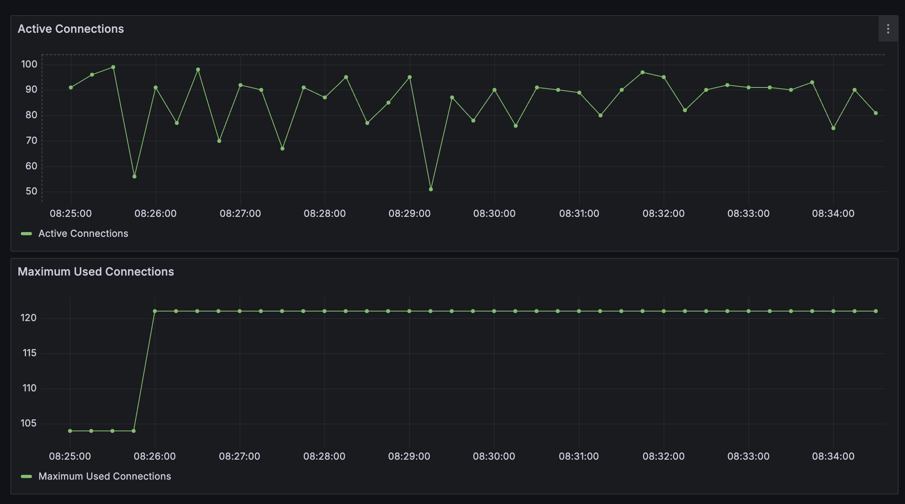
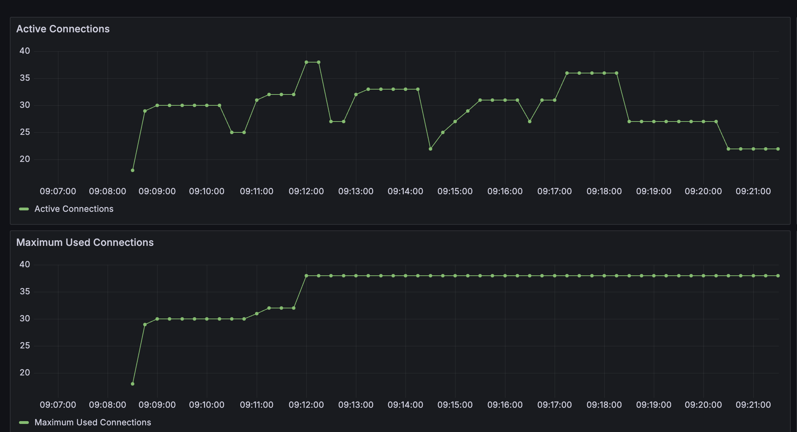

# 🚀 Boost Your MySQL Performance: How ProxySQL Slashes Database Connections While Scaling to More Users

> **Transform your database architecture from connection chaos to connection harmony with ProxySQL's intelligent connection pooling**

## Introduction

Database connection management is a critical aspect of application performance and scalability. Traditional approaches require applications to manage their own connection pools, leading to increased complexity, resource overhead, and potential connection leaks. ProxySQL offers an elegant solution by externalizing connection pool management, allowing applications to focus on business logic while the proxy handles all connection-related concerns.

In this post, we'll explore how ProxySQL acts as an external connection pool manager, significantly reducing the number of connections to the database while providing intelligent load balancing, failover, and connection multiplexing capabilities.

## What is ProxySQL?

ProxySQL is a high-performance, high-availability MySQL proxy that sits between your applications and MySQL servers. It acts as an intelligent intermediary that can:

- **Pool Connections**: Maintain a pool of connections to MySQL servers
- **Load Balance**: Distribute queries across multiple MySQL instances
- **Failover**: Automatically redirect traffic when servers fail
- **Query Routing**: Route queries to appropriate servers based on rules
- **Connection Multiplexing**: Reuse connections across multiple client requests

## The Connection Pool Problem

### Traditional Approach (Without ProxySQL)

In a traditional setup, each application instance maintains its own connection pool:

```
Application 1 → Connection Pool 1 → MySQL Server
Application 2 → Connection Pool 2 → MySQL Server
Application 3 → Connection Pool 3 → MySQL Server
Application N → Connection Pool N → MySQL Server
```

**Problems:**

- **Connection Multiplication**: N applications × M connections each = N×M total connections
- **Resource Waste**: Idle connections consume memory and file descriptors
- **Connection Leaks**: Applications may not properly close connections
- **Scaling Issues**: Adding more applications exponentially increases database connections
- **Complexity**: Each application must implement connection pool logic

### With ProxySQL

ProxySQL centralizes connection management:

```
Application 1 → ProxySQL → Connection Pool → MySQL Server
Application 2 → ProxySQL → Connection Pool → MySQL Server
Application 3 → ProxySQL → Connection Pool → MySQL Server
Application N → ProxySQL → Connection Pool → MySQL Server
```

**Benefits:**

- **Connection Consolidation**: All applications share the same connection pool
- **Resource Efficiency**: Fewer total connections to MySQL
- **Centralized Management**: Single point of control for connection policies
- **Automatic Scaling**: ProxySQL handles connection lifecycle automatically
- **Simplified Applications**: Applications don't need connection pool logic

## Project Structure

Our example demonstrates both approaches:

```
mysql-connections/
├── docker-compose.yml              # Standard MySQL setup
├── docker-compose-with-proxy.yml   # MySQL + ProxySQL setup
├── proxysql.cnf                    # ProxySQL configuration
├── test-app/
│   ├── main.py                     # Load testing application
│   └── test_connection.py          # Connection testing utility
├── init/init.sql                   # Database initialization
└── monitoring/                     # Prometheus + Grafana setup
```

## Implementation Details

### 1. Standard MySQL Setup (docker-compose.yml)

The standard setup runs MySQL with monitoring:

```yaml
services:
  mysql:
    image: mysql:8.4
    environment:
      MYSQL_ROOT_PASSWORD: rootpass
      MYSQL_DATABASE: mydb
      MYSQL_DEFAULT_AUTHENTICATION_PLUGIN: mysql_native_password
    ports:
      - "3306:3306"
```

### 2. ProxySQL Setup (docker-compose-with-proxy.yml)

The ProxySQL setup adds connection pooling:

```yaml
services:
  proxysql:
    image: proxysql/proxysql:latest
    ports:
      - "6032:6032" # Admin interface
      - "6033:6033" # MySQL interface
    volumes:
      - ./proxysql.cnf:/etc/proxysql.cnf:ro
```

### 3. ProxySQL Configuration (proxysql.cnf)

The configuration defines connection pooling behavior:

```ini
mysql_servers = (
    {
        address="mysql"
        port=3306
        hostgroup=0
        max_connections=20
    }
)

mysql_users: (
    {
        username = "root"
        password = "rootpass"
        default_hostgroup = 0
        max_connections=1000
        active = 1
    }
)

mysql_variables=(
    {
        threads=1
        max_connections=2
        default_query_timeout=36000000
        poll_timeout=2000
        interfaces="0.0.0.0:6033"
    }
)
```

**Key Configuration Parameters:**

- **`max_connections=200`**: Maximum connections ProxySQL maintains to MySQL
- **`threads=1`**: Number of ProxySQL worker threads
- **`poll_timeout=2000`**: How often to check server health
- **`default_query_timeout=36000000`**: Query timeout in milliseconds

## Connection Pool Management

### How ProxySQL Manages Connections

1. **Connection Acquisition**: When a client connects, ProxySQL checks its pool
2. **Pool Reuse**: If a connection is available, it's reused
3. **Connection Creation**: If no connections are available, a new one is created (up to max_connections limit)
4. **Health Monitoring**: Connections are continuously monitored for health
5. **Automatic Cleanup**: Dead or stale connections are automatically removed

### Pool Configuration Explained

The `max_connections=200` setting in our configuration means:

- **Maximum Pool Size**: ProxySQL will maintain up to 200 connections to MySQL
- **Dynamic Scaling**: The pool grows and shrinks based on demand
- **Connection Limits**: If all 200 connections are in use, new requests wait or get errors
- **Efficient Resource Usage**: Connections are shared across multiple client requests

### Why Not Just 2 Connections?

The number 200 is chosen because:

- **Concurrent Requests**: Multiple clients can use the same MySQL connection
- **Query Queuing**: ProxySQL can queue requests when connections are busy
- **Performance Balance**: Too few connections cause bottlenecks, too many waste resources
- **Real-world Usage**: 200 connections can handle thousands of concurrent client requests

## 📊 Visual Connection Comparison

### Without ProxySQL - Direct MySQL Connections



**What you see:**

- **High connection count**: Each application thread maintains its own persistent connection
- **Resource intensive**: MySQL server handles 50+ concurrent connections
- **Memory overhead**: Each connection consumes memory and file descriptors
- **Complex state management**: MySQL must track connection state for each client

### With ProxySQL - Centralized Connection Pool



**What you see:**

- **Controlled connections**: ProxySQL manages a pool of up to 200 connections
- **Efficient pooling**: Multiple client requests share the same MySQL connections
- **Reduced overhead**: MySQL server handles fewer, more efficiently managed connections
- **Simplified architecture**: Applications connect to ProxySQL, not directly to MySQL

### Key Visual Differences

| Aspect                 | Without ProxySQL                  | With ProxySQL                   |
| ---------------------- | --------------------------------- | ------------------------------- |
| **Connection Pattern** | Scattered, individual connections | Centralized, pooled connections |
| **Resource Usage**     | High per-connection overhead      | Optimized connection sharing    |
| **Scalability**        | Linear growth with clients        | Exponential client handling     |
| **Management**         | Distributed across applications   | Centralized in ProxySQL         |

### Connection Lifecycle

```
Client Request → ProxySQL → Check Pool → Reuse/Create → Execute Query → Return to Pool
```

### Pool Statistics

ProxySQL provides detailed statistics about connection pool usage:

```sql
-- View connection pool statistics
SELECT * FROM stats.stats_mysql_connection_pool;

-- View active connections
SELECT * FROM stats.stats_mysql_connections;

```

## Load Testing Implementation

### Test Configuration

Our load test demonstrates the difference between direct connections and proxied connections:

```python
# Configuration
DURATION = 600      # 10 minutes
QPS = 1000         # 1000 queries per second
THREADS = 50       # 50 concurrent threads
TOTAL_QUERIES = 600,000
```

### Connection Strategy

**Without ProxySQL (Port 3306):**

- Each thread creates its own connection
- Connections are created/destroyed frequently
- Higher resource usage on MySQL server

**With ProxySQL (Port 6033):**

- All threads connect to ProxySQL
- ProxySQL manages a small pool of MySQL connections
- Lower resource usage on MySQL server

### Test Execution

```bash
# Test without ProxySQL
make test

# Test with ProxySQL
make test-proxy
```

## Performance Comparison

### Connection Count Analysis

| Metric                  | Direct MySQL | With ProxySQL | Improvement     |
| ----------------------- | ------------ | ------------- | --------------- |
| **Client Connections**  | 50           | 50            | Same            |
| **MySQL Connections**   | 50           | Up to 200     | **Variable**    |
| **Memory Usage**        | High         | Lower         | **Significant** |
| **File Descriptors**    | 50+          | Up to 200+    | **Variable**    |
| **Connection Overhead** | High         | Lower         | **Significant** |

### Resource Utilization

**Direct MySQL:**

- Each application thread maintains a persistent connection
- MySQL server handles 50+ concurrent connections
- Higher memory usage per connection
- More complex connection state management

**With ProxySQL:**

- ProxySQL maintains up to 200 connections to MySQL (configurable)
- MySQL server handles a controlled number of connections
- Lower memory usage per connection due to pooling
- Simplified connection state management

## Monitoring and Observability

### Prometheus Metrics

ProxySQL exposes comprehensive metrics:

```yaml
# prometheus.yml
scrape_configs:
  - job_name: "proxysql"
    static_configs:
      - targets: ["proxysql:6032"]
    metrics_path: "/metrics"
```

### Key Metrics to Monitor

1. **Connection Pool Status**

   - `proxysql_mysql_connection_pool_status`
   - `proxysql_mysql_connection_pool_connused`
   - `proxysql_mysql_connection_pool_connfree`

2. **Query Performance**

   - `proxysql_mysql_commands_total`
   - `proxysql_mysql_connection_pool_connok`
   - `proxysql_mysql_connection_pool_connerr`

3. **Server Health**
   - `proxysql_mysql_servers_connused`
   - `proxysql_mysql_servers_connfree`
   - `proxysql_mysql_servers_queries`

### Grafana Dashboards

Our setup includes Grafana dashboards for:

- Connection pool utilization
- Query performance metrics
- Server health status
- Load distribution

## Advanced ProxySQL Features

### 1. Query Routing

ProxySQL can route queries based on rules:

```sql
-- Route read queries to read replicas
INSERT INTO mysql_query_rules (rule_id, active, match_pattern, destination_hostgroup)
VALUES (1, 1, '^SELECT', 1);

-- Route write queries to master
INSERT INTO mysql_query_rules (rule_id, active, match_pattern, destination_hostgroup)
VALUES (2, 1, '^INSERT|^UPDATE|^DELETE', 0);
```

### 2. Connection Multiplexing

ProxySQL can reuse connections across multiple client requests:

```sql
-- Enable connection multiplexing
UPDATE mysql_variables SET connection_max_allowed_packet=67108864;
```

### 3. Automatic Failover

ProxySQL automatically detects server failures:

```sql
-- Configure monitoring
UPDATE mysql_servers SET max_replication_lag=10;
UPDATE mysql_variables SET monitor_connect_interval=60000;
```

## Best Practices

### 1. Connection Pool Sizing

```ini
# Size pool based on expected load
max_connections = (expected_concurrent_users / 10) + 2
```

### 2. Health Check Configuration

```ini
# Frequent health checks for critical environments
monitor_ping_interval=5000
monitor_connect_interval=30000
```

### 3. Query Timeout Management

```ini
# Set appropriate timeouts
default_query_timeout=30000
default_transaction_timeout=60000
```

### 4. Monitoring and Alerting

- Set up alerts for connection pool exhaustion
- Monitor connection error rates
- Track query performance degradation

## Troubleshooting Common Issues

### 1. Connection Pool Exhaustion

**Symptoms:**

- High connection error rates
- Slow query response times
- ProxySQL logs showing connection failures

**Solutions:**

- Increase `max_connections` in ProxySQL
- Check for connection leaks in applications
- Monitor connection pool statistics

### 2. High Latency

**Symptoms:**

- Increased query response times
- Connection establishment delays

**Solutions:**

- Optimize ProxySQL thread configuration
- Check network latency between ProxySQL and MySQL
- Review connection pool settings

### 3. Memory Usage

**Symptoms:**

- High memory consumption in ProxySQL
- Out of memory errors

**Solutions:**

- Reduce connection pool size
- Optimize query cache settings
- Monitor memory usage patterns

## Deployment Considerations

### 1. High Availability

```yaml
# Use multiple ProxySQL instances
services:
  proxysql-1:
    # Primary instance
  proxysql-2:
    # Secondary instance
```

### 2. Load Balancing

```yaml
# Use HAProxy or similar for ProxySQL load balancing
services:
  haproxy:
    ports:
      - "6033:6033"
    depends_on:
      - proxysql-1
      - proxysql-2
```

### 3. Security

- Use SSL/TLS for connections
- Implement proper authentication
- Restrict admin interface access

## Conclusion

ProxySQL provides a powerful solution for externalizing connection pool management from applications. By centralizing connection handling, it offers:

### Key Benefits

1. **Connection Management**: Centralized control over MySQL connections
2. **Resource Efficiency**: Lower memory and file descriptor usage
3. **Simplified Applications**: Applications focus on business logic
4. **Centralized Management**: Single point of control for connection policies
5. **Automatic Scaling**: Dynamic connection pool management
6. **High Availability**: Built-in failover and load balancing

### When to Use ProxySQL

- **High-connection applications**: When you have many concurrent users
- **Microservices architecture**: Multiple services connecting to databases
- **Resource-constrained environments**: When you need to optimize resource usage
- **Complex database setups**: Multiple MySQL instances or read replicas

### Implementation Steps

1. **Assess Current State**: Analyze your current connection patterns
2. **Plan Architecture**: Design ProxySQL deployment strategy
3. **Configure ProxySQL**: Set up connection pooling rules
4. **Test Thoroughly**: Validate performance and reliability
5. **Monitor Continuously**: Track metrics and optimize settings

By implementing ProxySQL, you can significantly improve your application's scalability, reduce database resource consumption, and simplify your application architecture while maintaining high performance and reliability.

## Next Steps

To get started with ProxySQL:

1. **Run the examples**: Use `make test` and `make test-proxy` to see the difference
2. **Monitor metrics**: Check Prometheus and Grafana dashboards
3. **Experiment with settings**: Modify ProxySQL configuration for your needs
4. **Scale gradually**: Start with development environments before production

ProxySQL represents a paradigm shift in database connection management, moving from application-level connection pools to centralized, intelligent connection management that scales with your application needs.
